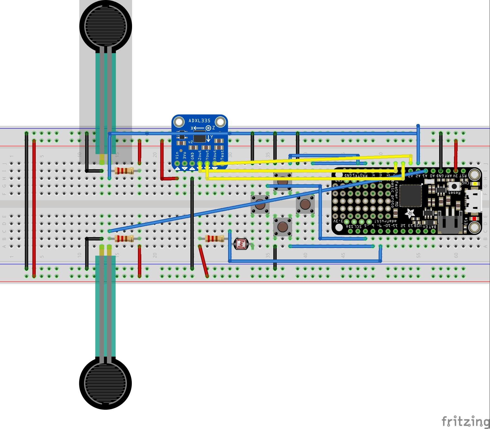
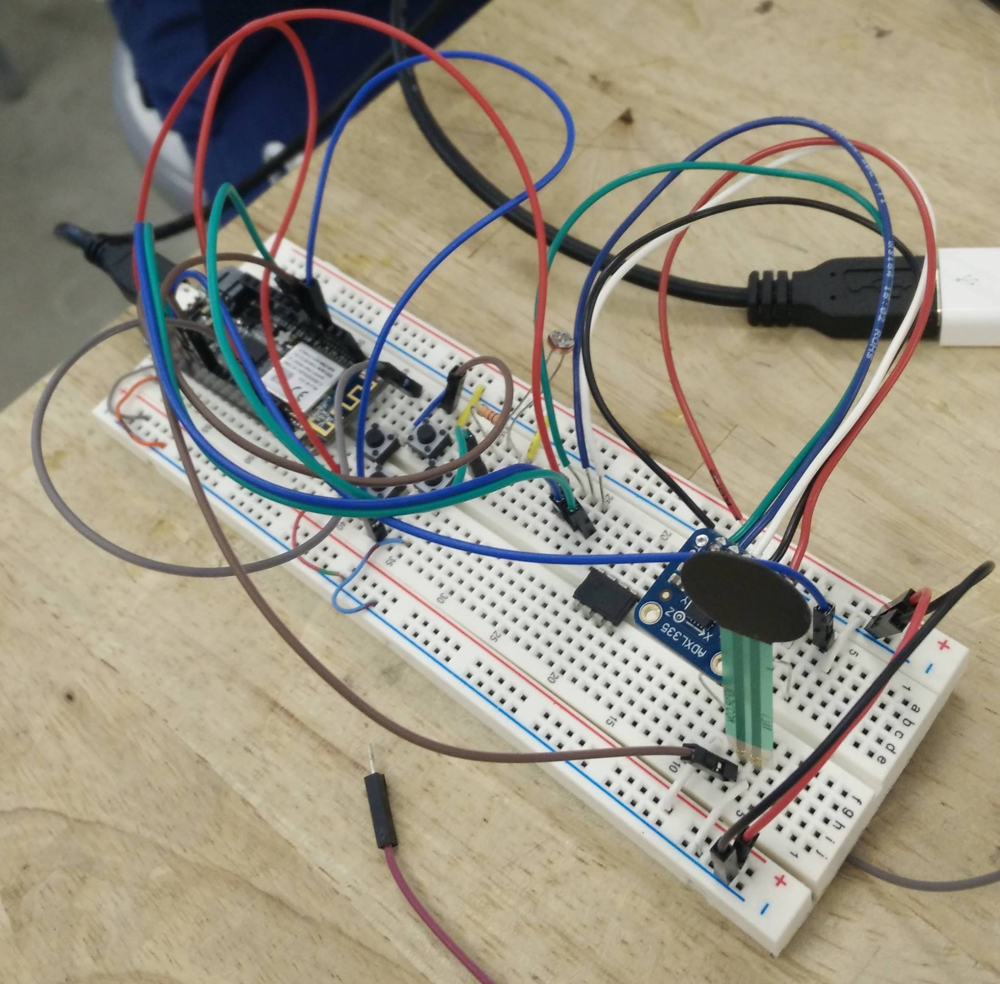
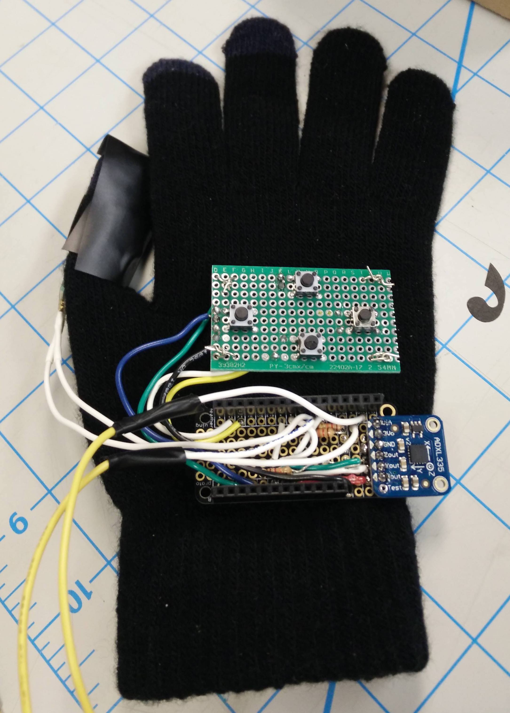
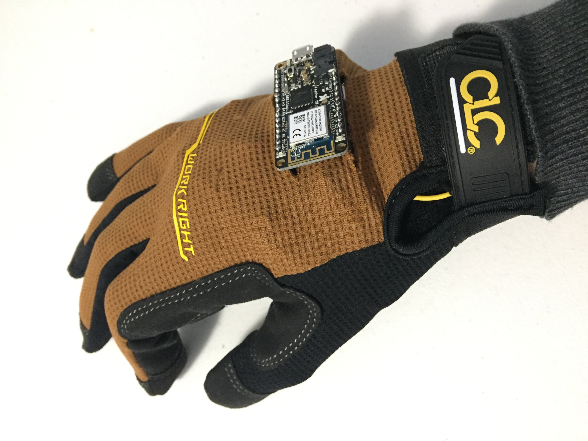
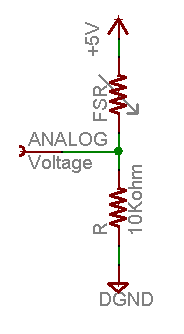

# HW3: Hand of Doom
Software & Electronics: Robby Gleiser

Assembly & Electronics: Emily Huynh

IDD Summer 2018

## Introduction
The *DOOM* series had its first release in 1993, and follows a space marine who fights demons and the undead in order to stay alive on Earth.  *DOOM* is considered one of the pioneering first person shooter (FPS) games, notable for being one of the first 3D FPS games. The version used in this project is *DOOM 64*, available on the Nintendo 64 and currently played on the computer using an emulator.


This aim of this homework was to integrate the controller with the user seamlessly, utilizing gesture-based controls to play the game.

## Hardware
### Circuit
The circuit consists of four switches, an Adafruit Feather M0, an LED, two force-sensing resistors (FSRs), and an accelerometer. The switches utilized internal pull-up resistors, and read ```LOW``` when pressed, and ```HIGH``` in a regular state. The FSRs were linearly, inversely related to the amount of force used to press the resistor-- the higher the force, the smaller the resistor (see: [Adafruit FSR Datasheet](https://cdn-learn.adafruit.com/assets/assets/000/010/126/original/fsrguide.pdf) for more information).  The Adafruit ADXL335 accelerometer board was powered by the 3.3V of the Feather by powering it via the 3Vo pin (see: [Adafruit ADXL335 Accelerometer Datasheet](http://www.analog.com/media/en/technical-documentation/data-sheets/ADXL335.pdf)).





### Assembly
We decided to use a glove because it would be the best form factor for users to play Doom.  In order to do so, the device is housed onto a liner glove made of fabric, which we attached the sensors to via adhesives or by threading a wire and tying the board to the fabric. This liner glove is covered by a thin, stretchy glove which covers the appearance of all electronics from the user, allowing for a more aesthetic appeal.



The final assembly included an FSR and photoresistor on the palm, an FSR on the thumbpad, and a protoboard of tactile switches and the Adafruit Feather M0 on the back of the hand. An accelerometer was mounted on top of the Feather M0. The functionality of these various sensors are outlined in Software: Mapping.



## Software
### Sensor Processing

###### Accelerometer
Accelerometers are sensitive to linear accelerations in 3 directions. In order to determine the orientation of the device through the accelerometer, we use the constant acceleration provided by the earth's gravitational field, which allows us to calculate the degree of rotation along the two horizontal axes. We call these values roll, caused by tilting the glove left and right, and pitch, caused by tilting the glove forward and back. In the case of our device, roll is defined by rotation about the X axis, and pitch is defined by rotation about the Z axis. Thus, as per [this documentation](http://cache.freescale.com/files/sensors/doc/app_note/AN3461.pdf) we use the following equations:


where G_x is the acceleration in the X+ direction, and so on. These equations assume that at rest, the sensors read (0, 1G, 0), and output a degree of rotation in the [-90, 90] range. For our device we simply define a threshold within this range for each of the four possible directions of rotation so that a key is pressed when the device is rotated beyond that threshold.

###### Force Sensitive Resistors

To measure the force resistive sensor we simply connect to power and a pull down resistor and measeure the voltage as one would a voltage divider:




Since the value of FSR decreases when pressure is applied, Vo increases when pressure is applied. For our device we simply define a threshold of a certain amount of pressure that will trigger a keypress when reached.

### Mapping
The mappings were intended to be intuitive to the user to reduce the learning curve. The movement used to activate these controls and its respective control in Doom respectively are listed below:

   1. Tilting hand forward/back --- Moves up/down
   2. Tilting hand left/right --- Left/right
   3. Finger gun and pressing thumb down --- Trigger/Enter
   4. Pressing fingers into palm --- Use button
   5. Auxiliary buttons ▲ ▼ ▶ ◀ --- Menu Navigation

Tilting (1 & 2) are controlled by the accelerometer, which detects in what direction the hand is accelerating. The gun trigger and palm (3 & 4) are activated by FSRs, and the auxiliary buttons (5) are used by the switches for simple navigation so that the game can be completely controlled via the gloves without having to reach for the mouse.

## Final Product Demo
This video shows the prototype being used play the first round of Doom.

[HW3 Demo: Hand of Doom](INSERT LINK HERE)

## Reflection
This was the first time that either of us had worked with fabric, so it was difficult in figuring out how to embed electronics (especially the protoboard and the Feather) into the glove. Neither of us knew how to sow, so we improvised and instead tied it with wire and depended on the outer glove to hold everything in place-- since the components were thick (especially the Feather), this ended up working out for us. The electronics were relatively easy since the sensors were well-documented and it was a matter of observing what our inputs were, turning it into useful data, and mapping it to the correct keys. The accelerometer was the trickiest; we utilized the roll and pitch characterizations to create useful data, but there were tradeoffs between sensitivity (detecting a correct movement) and specificity (making sure slight tremors weren't registered as a movement), so that was difficult for us.
